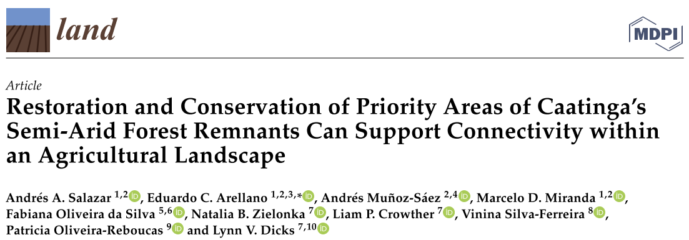

\
\
\
**This repository contains three LULC's rasters (year 1985, 2000 and 2018).**
\
\
\
**The classes of the LULC's rasters are:** 
\
\
\
**1) Water**

**2) Urban**

**3) Pasture**

**4) Agriculture**

**5) Open Caatinga**

**6) Dense Caatinga**
\
\
\
**In addition, in this repository there are four rasters of prioritizations:**
\
\
\
**1) ec1.tif -> Conservation scenario 1**

**2) ec2.tif -> Conservation scenario 2**

**3) er1.tif -> Restoration scenario 1**

**4) er2.tif -> Restoration scenario 2**
\
\
\
**See more information about the scenarios in the paper**
